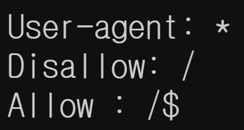
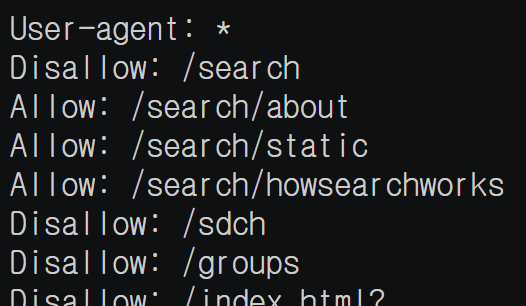

# 2021.09.18(WED) 유튜브 생활코딩 HTML 강의

## 1. 검색엔진최적화 6 : robotstxt & sitemap

### robots.txt를 효과적으로 활용하기
- 크롤링을 하기 위해 사이트에 접근하는 robot들이 있다. 해킹을 하기위한 로봇, 검색엔진 등이 있다.

- 사이트별 로봇 접근을 통제할 수 있다.

- robots.txt => allow vs disallow



=> Naver robots.txt



=> Google robots.txt

- Sitemap

- xml

### Reference
> https://www.youtube.com/watch?v=hRmfZxXa3KA&list=PLuHgQVnccGMDUzDDCKW-pCZQY-MMCX5yB&index=37

<br>

## 2. 검색엔진최적화 7 : 페이지랭크

- 많은 사이트들이 링크를 하고있다면, 해당 사이트는 다른 사이트보다 더 좋은 품질의 콘텐츠를 가지고 있을 확률이 높다. 

- 페이지랭크가 높은 사이트가 다른 사이트를 링크한다면, 그 다른 사이트의 페이지랭크를 더 높이 쳐준다.

### Reference
> https://www.youtube.com/watch?v=tagJ0lm6CK8&list=PLuHgQVnccGMDUzDDCKW-pCZQY-MMCX5yB&index=38

<br>

## 3. 웹 개발자 도구
: 웹 개발을 하는데 필요한 여러가지 기능을 모아둔 도구들로, 웹브라우저별로 비슷한 기능의 도구를 제공하고 있다. 해당 영상에서는 HTML 개발과 관련된 부분에 초점을 맞춰서 크롬 개발자 도구를 살펴본다.
ㅀ
- 마우스 우 클릭 : 검사, 페이지 소스 보기
- 검사 => Toggle 클릭 => 디바이스 별로 보이는 웹페이지를 보여줌.
- 검사 => Network : 웹페이지에 이미지 혹은 HTML 파일과 같이 다운받아야 할 파일을 알려줌

- 추가적인 내용은 [크롬개발자 도구 수업 바로가기](https://opentutorials.org/module/306/2865) 참고

### Reference
> https://www.youtube.com/watch?v=q_8rVZmMt6M&list=PLuHgQVnccGMDUzDDCKW-pCZQY-MMCX5yB&index=39

<br>

## 4. 모바일 지원
: 만든 웹페이지를 모바일에서 보기 편하게 HTML로 구현해본다.

```HTML
<meta name="viewpoint" content="width=device-width, initial-score=1.0>
```

- meta 태그를 사용하여 모바일 환경과 데스크탑 환경에 맞게 웹페이지가 출력되도록 한다.
- width=device-width : 폭(=width)을 device의 폭에 맞게 설정한다.
- initial-score=1.0 : 웹페이지에 처음 들어갔을 때, 줌인 혹은 줌아웃의 정도를 설정한다. initial-score=1.0은, 웹페이지를 설정한 그대로 보여준다는 의미이다.
- 요즘은 디바이스의 종류가 다양하므로, 사실상 기계적으로 해당 코드를 삽입해주면 된다.

### Reference
> https://www.youtube.com/watch?v=rF2nkJCH55c&list=PLuHgQVnccGMDUzDDCKW-pCZQY-MMCX5yB&index=40

<br>

## 5. HTML5의 새로운 제출양식 1
: HTML5의 새로 추가된 input types. 개발자가 사용자의 정보 입력을 엄격하게 통제할 수 있다.

```HTML
<input type="number">
```
- number type은 숫자만 입력할 수 있게 한다. 숫자 이외의 문자를 입력하려 할 경우, 입력되지 않는다.

```HTML
<input type="number" min="10" max="15">
```
- 10 이상 15 이하의 숫자만 입력 가능하다.

```HTML
<input type="color">
```
- color input types : 색깔을 쉽게 선택할 수 있는 화면이 출력된다.

```HTML
<input type="data">
```
- data input types : 날짜를 입력할 수 있는 화면이 출력된다.

- 다양한 input types : color / date / email / month / number / range / search / tel / time / url / week

### Reference
> https://opentutorials.org/module/1892/11038