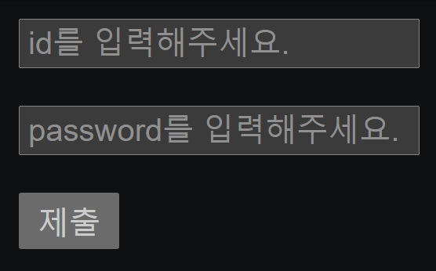

# 2021.09.18(WED) 유튜브 생활코딩 HTML 강의

## 1. HTML5 form 3 : 새로운 속성들

```HTML
<form action="login.php" autocomplete="on">
```
- autocomplete="on" : 자동 완성 기능 활성화

```HTML
<input type="password" name="password" autocomplete="off">
```
- autocomplete="off" : 자동 완성 기능 비활성화

```HTML
<input type="text" name="id" placeholder="id를 입력해주세요.">
<input type="password" name="password" placeholder="password를 입력해주세요.">
```
- placeholder : 입력칸에 default로 설명을 알려준다.



```HTML
<input type="text" name="id" placeholder="id를 입력하세요." autofocus>
```
- autofocus : 웹페이지에 접근할 때, 커서가 자동으로 해당 텍스트란에 focus(위치)하게 된다.

### Reference
> https://www.youtube.com/watch?v=36Z-N1wa9lA&list=PLuHgQVnccGMDUzDDCKW-pCZQY-MMCX5yB&index=43

<br>

## 2. HTML5 form 4 : 입력 값 체크
: HTML 코드만으로도 사용자가 입력한 정보의 유효성을 체크할 수 있다.

```HTML
<input type="email" name="email" placeholder="이메일을 입력">
<input type="submit">
```
- email칸에 email을 입력하지 않으면(@ 입력) 제출이 되지 않는다.

```HTML
<input type="text" name="id" placeholder="id를 입력하세요." required>
```
- required : 반드시 입력해야 하는 칸(필수 입력)을 의미한다. 입력하지 않고 제출할 경우, 제출이 되지않는다.

```HTML
<input type="text" name="id" placeholder="id 입력" required pattern="[a-zA-Z].">
```
- pattern="[a-zA-Z]." : id 입력 칸의 첫번째 글자는, a부터 z 혹은 A부터 Z 사이의 문자 중 하나만 올 수 있다. 그 다음 두번째 글자는 아무거나 와도 상관없다. 점(.)이 의미하는 바가 아무거나 상관없다는 의미이다.

- 다만, 세번째 글자를 입력하면 제출이 되지 않는다. 첫번째 글자와 두번째 글자만 정의해주었기 때문이다.

```HTML
<input type="text" name="id" placeholder="id 입력" required pattern="[a-zA-Z].+">
```
- pattern="[a-zA-Z.+]" : 첫번째 글자는 소문자 a부터 대문자 Z까지, 두번째 글자부터는 아무 글자나 와도 상관없다.

- 단, 첫번째 글자만 쓰고 제출하면 제출되지 않는다.

- .+의 의미는, 모든 문자가 하나 아니면 그 이상의 문자가 온다는 것을 의미한다.

```HTML
<input type="text" name="id" placeholder="id 입력" required pattern="[a-zA-Z].+[0-9]">
```

- [0-9] : 제일 끝 문자는 숫자가 입력되어야 한다.

### 이외의 정규 표현식은 아래의 링크를 참고한다.
> https://opentutorials.org/course/909/5142

### Reference
> https://www.youtube.com/watch?v=dJOhEj9_6gM&list=PLuHgQVnccGMDUzDDCKW-pCZQY-MMCX5yB&index=44