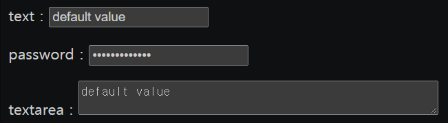
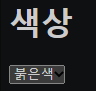
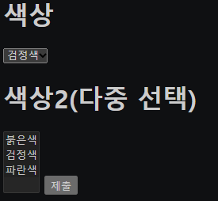

# 2021.09.10(FRI) 유튜브 생활코딩 HTML 강의
## 1. form : 기본
사용자로부터 정보(아이디, 비밀번호 등)를 입력받을 때 사용하는 태그
<br>

```html
<input type="text">
```

- 사용자로부터 문자(= text)를 입력받는 태그
- 속성을 type="password"로 변경해주면 사용자가 입력하는 정보가 외부로 노출되지 않는다.

<br>

```html
<input type="summit">
```

- "제출" 버튼이 생겨 정보를 다른 곳으로 보낼 수 있다.

<br>

```html
<form action="http://localhost/login.php">
```

- 입력받은 정보(아이디, 비밀번호 등)를 특정 서버로 보내는 태그

<br>

```html
아이디 : <input type="text" name="id">
```
```html
주소 : <input type="text" name="address">
```

- 동일한 속성 type="text"에 대해 name 속성을 추가해주어 서로 다른 정보를 입력했음을 알려준다.

```html
<html>
    <body>
        <form action="http://localhost/login.php">
            <p>아이디 : <input type="text" name="id"></p>
            <p>비밀번호 : <input type="password" name="pwd"></p>
            <p>주소 : <input type="text" name="address"></p>
            <input type="submit">
        </form>
    </body>
</html>
```

### Reference
> https://www.youtube.com/watch?v=sFtZdlmgCVY&list=PLuHgQVnccGMDUzDDCKW-pCZQY-MMCX5yB&index=19

<br>

```
아이디 : it'smyid  
비밀번호 : it'smypassword  
주소 : it'smyaddress  
```

위와 같이 정보를 입력하면 아래의 사이트로 연결된다.

> http://localhost/login.php?id=it%27smyid&pwd=it%27smypassword&address=it%27smyaddress

HTML과 크게 상관없는 것 같지만 그냥 생각해보면, %27은 아스키코드의 십육진법 표를 보면 `을 의미하는 것을 알 수 있다. 아스키코드로 주소도 나타내나 보다.
<br>

## 2. form : 문자입력
```html
<html>
    <body>
        <form action="">
            <p>text : <input type="text" name="id" value="default value"></p>
            <p>password : <input type="password" name="pwd" value="default value"></p>
            <p>textarea : 
            <textarea name="" id="" cols="50" rows="2">default value</textarea></p>
        </form>
    </body>
</html>
```


- value 속성 : 빈칸에 기본적으로 들어갈 값(default value)을 나타낸다.
- textarea 태그 : 한 문장이 아닌 여러줄의 문장을, 임의의 칸에 써야할 경우 사용하는 태그.
    - cols와 rows 속성을 통해 열과 행의 크기를 조정할 수 있다.
    - textarea의 value 속성은 열린 태그와 닫힌 태그 사이에 입력한다.

### Reference
> https://www.youtube.com/watch?v=-wMLXTISFFY&list=PLuHgQVnccGMDUzDDCKW-pCZQY-MMCX5yB&index=20
<br>

## 3. form : dropdown list
```html
<h1>색상</h1>
<select>
    <option>붉은색</option>
    <option>검정색</option>
    <option>파란색</option>
</select>
```
- select 태그 : dropdown list 생성
- option 태그 : dropdown list의 목록 생성



```html
<html>
    <head>
        <meta charset="UTF-8">
    </head>

    <body>
    <form action="http://localhost/color.php">
        <h1>색상</h1>
        <select name="color">
            <option>붉은색</option> 
            <option>검정색</option>
            <option>파란색</option>
        </select>
        <input type="submit">
    </form>
    </body>
</html>
```
- select의 속성으로 name="color"를 입력하면 아래와 같은 주소창으로 이동한다. name 속성을 입력하지 않으면 ?까지만 출력된다.
```
http://localhost/color.php?color=검정색
```

```html
<option value="red">붉은색</option>
<option value="black">검정색</option>
<option value="blue">파란색</option>
```
- 붉은색, 검정색, 파란색은 사용자가 보기 편하게 설정된 것으로, 기계가 보기 편하게 다른 단어로 바꿔줄 수 있다. option 태그에서 value 속성을 이용하면 변경할 수 있다.

```html
<html>
    <head>
        <meta charset="UTF-8">
    </head>

    <body>
    <form action="http://localhost/color.php">
        <h1>색상</h1>
        <select name="color">
            <option value="red">붉은색</option> 
            <option value="black">검정색</option>
            <option value="blue">파란색</option>
        </select>

        <h1>색상2(다중 선택)</h1>
        <select name="color2" multiple>
            <option value="red">붉은색</option> 
            <option value="black">검정색</option>
            <option value="blue">파란색</option>
        </select>

        <input type="submit">
    </form>
    </body>
</html>
```
- select 태그에서 multiple을 추가해주면 다중선택이 가능하다. 단, 다중선택을 하기위해서는 ctrl을 누른 상태에서 클릭해주어야 한다. 사용자가 이에 대해 모를 수 있으므로, 추후에 배울 체크박스가 더 유용하다.

