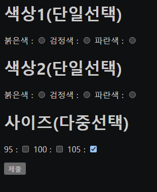

# 2021.09.11(SAT) 유튜브 생활코딩 HTML 강의

## form : radio, checkbox

```html
<input type="radio" name="color">
```
- 동그란 모양의 체크박스
- 이전의 input 태그(text 속성) 사용하는 방법과 동일하며 type만 radio로 변경해주면 된다.

<br>

```html
<input type="radio" name="color">
<input type="radio" name="color">
```
- 두 개의 동그란 체크박스가 생긴다.
- 옛날 라디오는 하나의 버튼을 누르면 다른 버튼은 선택해제가 되었는데 여기서 착안을 하였다.

<br>

```html
        <p>
            <h1>색상1(단일선택)</h1>
            붉은색 : <input type="radio" name="color" value="red">
            검정색 : <input type="radio" name="color" value="black">
            파란색 : <input type="radio" name="color" value="blue">
        </p>

        <p>
            <h1>색상2(단일선택)</h1>
            붉은색 : <input type="radio" name="color2" value="red">
            검정색 : <input type="radio" name="color2" value="black">
            파란색 : <input type="radio" name="color2" value="blue">
        </p>
```


- input 태그 사용방법은 동일하다.

<br>

```html
        <p>
            <h1>사이즈(다중선택)</h1>
            95 : <input type="checkbox" name="size" value="95">
            100 : <input type="checkbox" name="size" value="100">
            105 : <input type="checkbox" name="size" value="105" checked>
        </p>
```
- radio가 아닌 checkbox를 입력할 경우, 다중선택이 가능하다.
- 속성으로 checked를 추가하면 해당 체크박스는 기본으로 체크가 된다.

<br>

```html
<html>
    <head>
        <meta charset="UTF-8">

    </head>

    <body>
        <form action="http://localhost/order.php">
        <p>
            <h1>색상1(단일선택)</h1>
            붉은색 : <input type="radio" name="color" value="red">
            검정색 : <input type="radio" name="color" value="black">
            파란색 : <input type="radio" name="color" value="blue">
        </p>

        <p>
            <h1>색상2(단일선택)</h1>
            붉은색 : <input type="radio" name="color2" value="red">
            검정색 : <input type="radio" name="color2" value="black">
            파란색 : <input type="radio" name="color2" value="blue">
        </p>

        <p>
            <h1>사이즈(다중선택)</h1>
            95 : <input type="checkbox" name="size" value="95">
            100 : <input type="checkbox" name="size" value="100">
            105 : <input type="checkbox" name="size" value="105" checked>
        </p>
        <input type="submit">
        </form>
    </body>
</html>
```
- 최종 코드



### Reference
> https://www.youtube.com/watch?v=LYFOUIDBIp4&list=PLuHgQVnccGMDUzDDCKW-pCZQY-MMCX5yB&index=23