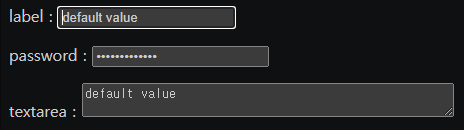
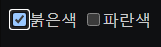

# 2021.09.13(MON) 유튜브 생활코딩 HTML 강의

## 1. form : hidden
```HTML
<input type="hidden" name="hide" value="egoing">
```
```text
http://localhost/hidden.php?id=abcd&hide=egoing
```
위의 사이트는, text란에 abcd를 입력하고 "제출"하면 이동되는 주소이다.

- UI가 없지만 서버로 어떤 값을 전송하고 싶을 때는 hidden이라는 type의 input 태그를 사용하면 된다.
- 현업에서 개발하다보면 자연스럽게 알게 되며 지금 설명하기에는 복잡하다.

### Reference
> https://www.youtube.com/watch?v=viGaQ2i8t44&list=PLuHgQVnccGMDUzDDCKW-pCZQY-MMCX5yB&index=24

<br>

## 2. form : label
### 2.1 예제코드 : label

```HTML
    <p>
        label : 
        <input type="text" name="id" value="default value">
    </p>
```
위의 코드에서 label이 정확히 무엇을 의미하는지 알기 힘들다. label이 무엇을 의미하는지 정확하게 나타내기 위해 label 태그를 사용한다. 즉, **무언가의 이름표**로 이해할 수 있다. 아래의 코드가 label 태그를 추가한 코드이다.

```HTML
    <p>
        <label>label</label> : 
        <input type="text" name="id" value="default value">
    </p>
```

### 2.2 예제코드 : for
```HTML
    <p>
        <label>label</label> : 
        <input type="text" name="id" value="default value">
    </p>
    <p>
        <label>password</label> : 
        <input type="password" name="pwd" value="default value">
    </p>
```

위의 코드처럼 label 태그가 여러개인 경우, 어떤 input 태그에 대한 label 태그인지를 알 수 없다. 이를 해결하기 위해 for 속성을 이용한다. 아래의 코드를 참고한다.

```HTML
    <p>
        <label for="id_txt">label</label> : 
        <input id="id_txt" type="text" name="id" value="default value">
    </p>
    <p>
        <label for="pw_label">password</label> : 
        <input id="pw_label" type="password" name="pwd" value="default value">
    </p>
    <p>
        textarea : 
    <textarea name="" id="" cols="50" rows="2">default value</textarea>
    </p>
```


위의 사진을 자세히 보면, label을 클릭하게 될 경우 label에 해당하는 text 칸에 커서가 이동하게 된다. 마찬가지로 password를 클릭하게 되면 password에 해당하는 text 칸으로 커서가 이동하게 된다.

### 2.3 예제코드 : 다른 표현방법
```HTML
    <p>
        <label>
            <input type="checkbox" name="color" value="red">붉은색
        </label>

        <label for="color_blue">
            <input id="color_blue" type="checkbox" name="color" value="blue">파란색
        </label>
    </p>
```


- 이전처럼 for + id 속성을 사용하거나, label 태그를 input 태그 앞 뒤로 위치시켜 표현할수도 있다.

- label을 사용해 checkbox를 구현할 경우, 붉은색 혹은 파란색만 눌러도 체크가 된다.

### Reference
> https://www.youtube.com/watch?v=_4upG-03td8&list=PLuHgQVnccGMDUzDDCKW-pCZQY-MMCX5yB&index=25


## form : method
